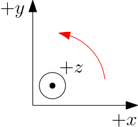

# 04-3D

## 1. Introduction

Now, let's go 3D in opengl.

*(figure is copied from the [glumpy](http://glumpy.readthedocs.org/) project)*

In real world, we are facing a LCD which is basically a 2D plane (well, **VR** technology might be a revolution to this), the 3D scene is projected on the plane to create a fake 3D view. We need to understand 3 types of matrix:

 - **Model matrix** maps from an object’s *local coordinate space* into *world space*. For example, a model is described using its local coordinates, and then we may apply model matrix to rotate, sheer or move this object.
 - **View matrix** maps from *world space* to *camera space*. In the **perspective** or **orthographic** projection, the camera is placed at `(0, 0, 0)` and looks at `(0, 0, 1)`, this view matrix serves as place the object orientated at the scene in front of the camera.
 - **Projection matrix** maps from *camera* to *screen space*, i.e., perspective projection or orthographic projection. This matrix mapps 3D world to 2D scene when rendering.

More details on how these matrix was generated can be found at any computer graphic book.

**Note:** the axis (coordinates) of opengl follows right-hand rule, where `+x` is left-to-right, `+y` is down-to-up, and `+z` is the direction of your thumb when you curl the fingers of your right-hand from `+x` to `+y`.

